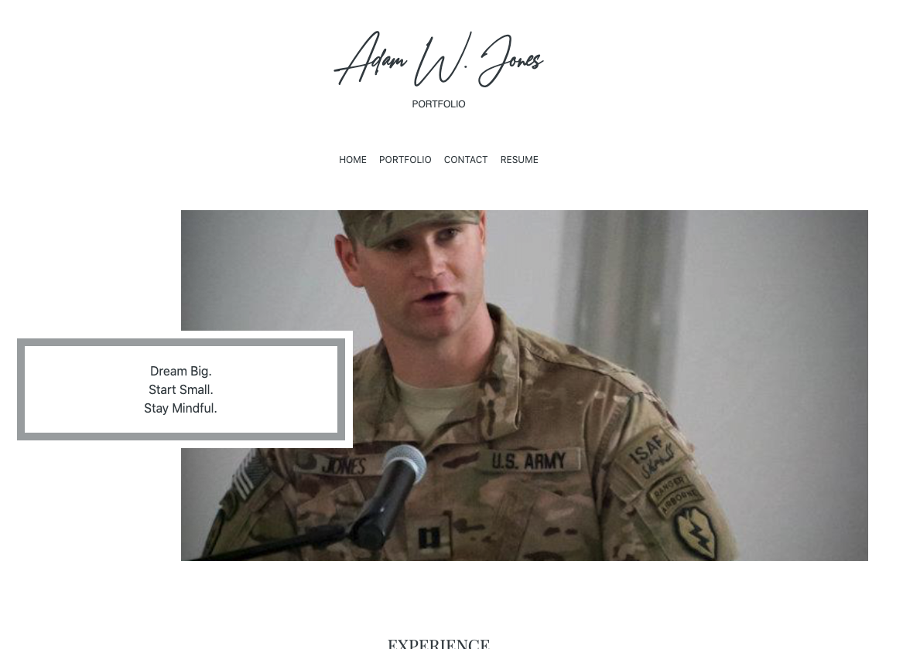

# Portfolio
* By: Adam Jones
* Date: 7/7/20; Refactored on 8/21/20
* URL for Deployed Application: https://adamwjones.github.io
* URL for GitHub repository: https://github.com/adamwjones/adamwjones.github.io.git

## Objective
* Design and Develop a Responsive Portfolio 

## Updated content 
* Links to my GitHub profile & LinkedIn page 
* A link to a PDF of my resume
* A list of projects including project title, a link to the deployed version, and a screenshot of the deployed application
* Updated GitHub Profile with my bio, location, email, and link to my portfolio
* Updated Resume
* Updated LinkedIn Profile with link to portfolio and GitHub 

## Original content 
* index.html
* portfolio.html 
* contact.html
* Uses Bootstrap
* A navbar
* A responsive layout
* Responsive images
* Minimize the use of media queries - only has two in order to adjust the Navbar for a better UX in mobile mode and the Signature Card so that it looks visually more appealing in full screen. 
* Use Bootstrap's grid system (containers, rows, and columns).
* Use an HTML validation service to ensure that each page has valid HTML.
* Functional, deployed application
* GitHub repository with README describing the project
* Navbar must be consistent on each page.
* Navbar on each page must contain links to Home/About, Contact, and Portfolio pages.
* All links must work.
* Must use semantic html.
* Each page must have valid and correct HTML. (use a validation service)
* Must contain your personalized information. (bio, name, images, links to social media, etc.)
* Must properly utilize Bootstrap components and grid system

## Screenshot 
 

